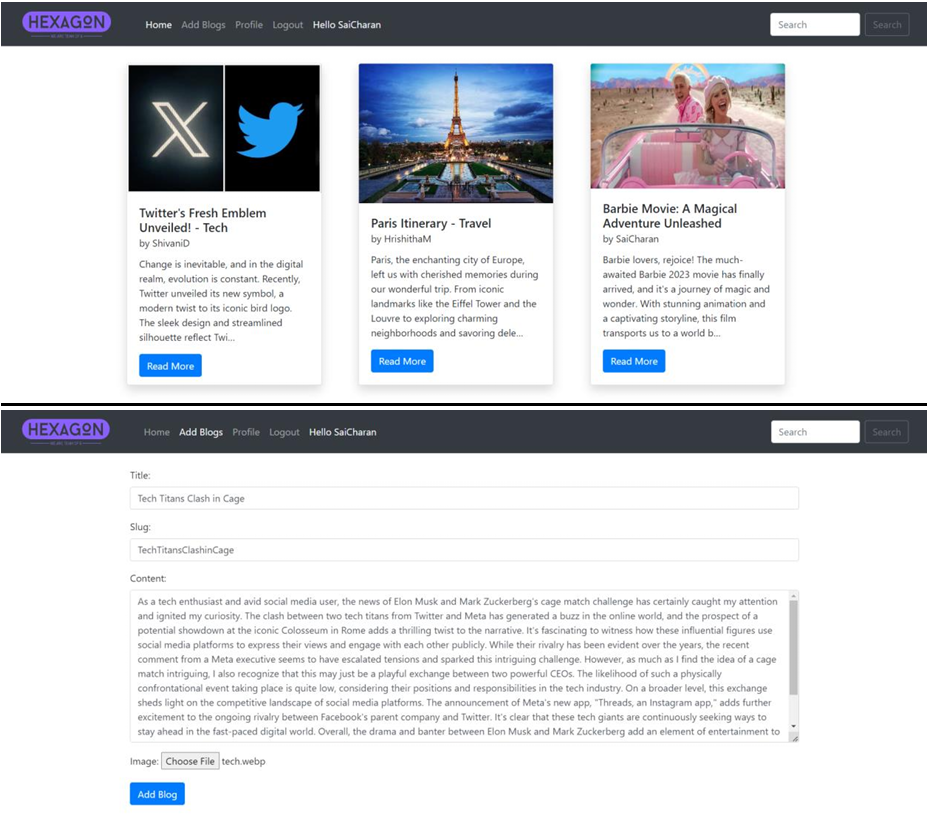
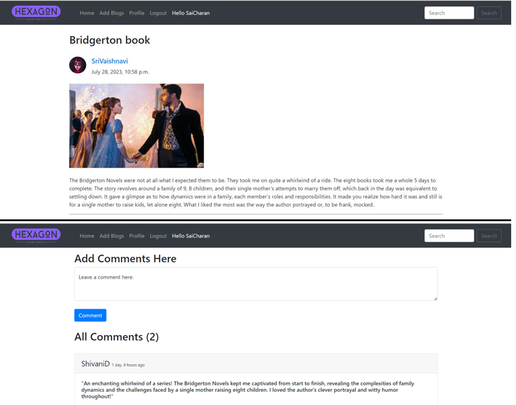
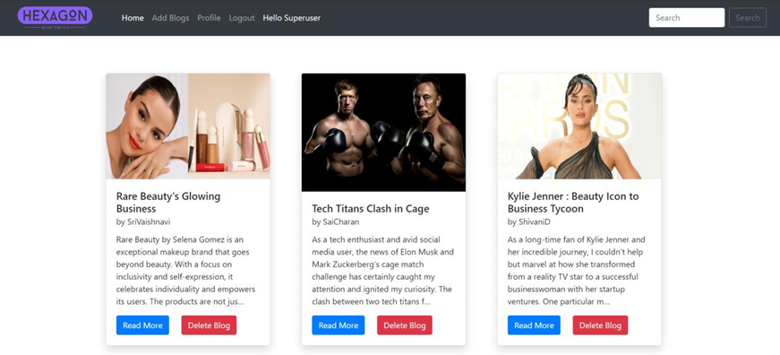

# Project Statement: Hexagon Blogging Platform

The aim of the project is to create a Django-based blogging application integrated with other web technologies such as Bootstrap and JavaScript.

## Description

A blog is an online platform where individuals or businesses regularly share their thoughts, expertise, and experiences on various topics. Through written articles, images, and multimedia content, bloggers engage with their audience, offering valuable insights, entertainment, and information. Blogs serve as a dynamic medium for communication and community building on the internet.

### Features

1. **Public Access with Limited Features:**
   - Users can read blog posts without logging in.
   - Features like commenting and adding new blogs are restricted until login.

2. **Registration and Login:**
   - Bootstrap-based registration and login pages with proper validation.
   - Users register with username, first and last name, email, and password.
   - Successful registration redirects users to the login page for access.

3. **Attractive Logo and Navigation:**
   - Named the website "Hexagon" with an attractive logo.
   - Navbar includes main features: home, add blog, search, profile view.

4. **Read More Option:**
   - Allows users to expand blog posts for full content display.
   - Shows posting time for each blog entry.

5. **Add Blog Feature:**
   - Logged-in users can add new blog posts.
   - Required fields include title, image, content, etc.
   - Posts are displayed chronologically based on upload time.

6. **Edit Blog Post:**
   - Users can edit their own blog posts.
   - Editing updates content details according to user input.

7. **User Profile:**
   - Displays user details such as full name, username, email, social media IDs, profile picture.
   - Users can edit their profile information multiple times.

8. **Search Functionality:**
   - Effective search by title across the entire website.
   - Displays partial matches and handles cases with no results.

9. **Display Username:**
   - Shows logged-in user's username on the Navbar.

10. **Commenting Feature:**
    - Users can express opinions through comments on any post.

11. **Superuser Privileges:**
    - Superusers have the ability to delete any post on the platform.
    - Ensures website ethics and values are maintained.

### Snapshots

